# xView2 Building Damage Segmentation: AI for Disaster Response

**Course:** 60.001 Applied Deep Learning, Y2026
**Team:** [Member names and student IDs]
**GitHub:** [Repository URL]
**Dataset:** [Kaggle xView2 Tier 3](https://www.kaggle.com/datasets/tunguz/xview2-challenge-dataset-tier-3-data)
**Model Weights:** [Google Drive / Dropbox link]

---

## 1. Introduction

### 1.1 Problem Statement

When natural disasters strike, rapid assessment of building damage is critical for directing emergency resources. Traditional damage assessment relies on ground surveys that take days to weeks -- time that costs lives. Satellite imagery is available within hours, but manually inspecting thousands of buildings across disaster zones does not scale.

This project develops a deep learning model for **automated building damage segmentation** from pre- and post-disaster satellite imagery. Given a pair of satellite images (before and after a disaster), the model produces a pixel-level damage map classifying every building into one of four damage levels: No Damage, Minor Damage, Major Damage, and Destroyed.

### 1.2 Objectives

1. Design and implement a Siamese U-Net architecture for change-detection-based damage segmentation
2. Systematically improve model performance through iterative experimentation -- training strategy, regularization, backbone scaling, and loss function design
3. Evaluate against the xView2 competition benchmark and analyse failure modes
4. Deliver a reproducible, well-documented codebase with saved model weights

### 1.3 Scope and Constraints

- **Dataset:** xView2 Tier 3 (~2,200 image pairs), a subset of the full xBD dataset (~22,000 pairs) used in the original competition
- **Compute:** Single GPU training (Kaggle P100 / SUTD AI Cluster).
- **Architecture:** Single-model inference (no ensembling), to keep the system practical for real deployment
- **Classes:** 5-class segmentation -- Background (0), No Damage (1), Minor Damage (2), Major Damage (3), Destroyed (4)

### 1.4 Social Impact

Automated damage assessment directly supports humanitarian response:
- **Speed:** Reduces assessment time from days to minutes
- **Scale:** Can process entire cities simultaneously
- **Objectivity:** Consistent classification across analysts
- Organizations like the UN, Red Cross, and FEMA have identified automated satellite damage assessment as a priority capability for disaster response

---

## 2. Dataset

### 2.1 Source

The [xView2 dataset](https://xview2.org/) was created by the Defense Innovation Unit (DIU) for the xView2 Building Damage Assessment Challenge. It contains WorldView-3 satellite imagery (1.4m GSD) across multiple disaster types (earthquakes, hurricanes, wildfires, volcanic eruptions, floods).

### 2.2 Structure

| Property | Value |
|----------|-------|
| Image pairs | ~2,200 (pre + post disaster) |
| Original resolution | 1024 x 1024 px |
| Training resolution | 512 x 512 px (resized) |
| Annotation format | GeoJSON polygons per building |
| Split | 80% train / 10% val / 10% test |
| Seed | 42 (deterministic split) |

### 2.3 Class Distribution

The dataset exhibits extreme class imbalance:

| Class | Pixel Proportion | Description |
|-------|-----------------|-------------|
| Background | ~97% | Non-building pixels |
| No Damage | ~1.5% | Intact buildings |
| Minor Damage | ~0.3% | Cosmetic damage |
| Major Damage | ~0.5% | Structural damage |
| Destroyed | ~0.7% | Collapsed/razed |

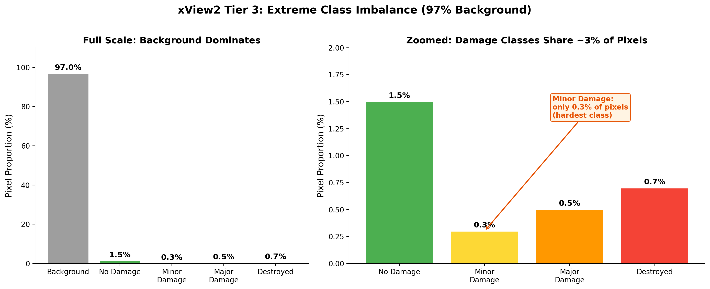

This imbalance is a central challenge: a model predicting "background" everywhere achieves 97% pixel accuracy while being completely useless. This is why we adopted **Damage Macro F1** (macro average of F1 for classes 1-4, excluding background) as our primary evaluation metric from Experiment 3 onward.

### 2.4 Preprocessing

- Polygon annotations rasterized to per-pixel masks using Shapely and scikit-image
- Images resized from 1024x1024 to 512x512 via bilinear interpolation
- ImageNet normalization applied (mean=[0.485, 0.456, 0.406], std=[0.229, 0.224, 0.225])

### 2.5 Data Augmentation

Augmentation strengths were tuned across experiments (values below are from our final configuration, Exp 5):

| Augmentation | Probability | Purpose |
|-------------|------------|---------|
| Horizontal flip | 0.5 | Orientation invariance |
| Vertical flip | 0.2 | Orientation invariance |
| Random 90-degree rotation | 0.5 | Rotation invariance |
| Brightness jitter | +/-0.15 | Lighting robustness |
| Contrast jitter | +/-0.15 | Lighting robustness |
| Saturation jitter | +/-0.10 | Color robustness |
| Gaussian blur | 0.15 | Resolution robustness |
| Gaussian noise | 0.15 | Sensor noise robustness |

---

## 3. Method

### 3.1 Architecture: Siamese ResNet U-Net

The model follows a Siamese encoder -- fusion -- decoder paradigm designed for change detection:

```
Pre-disaster image  --> [Shared ResNet Encoder] --+
                                                  |--> FusionBlocks (x5) --> U-Net Decoder --> 5-class Damage Map
Post-disaster image --> [Shared ResNet Encoder] --+
```

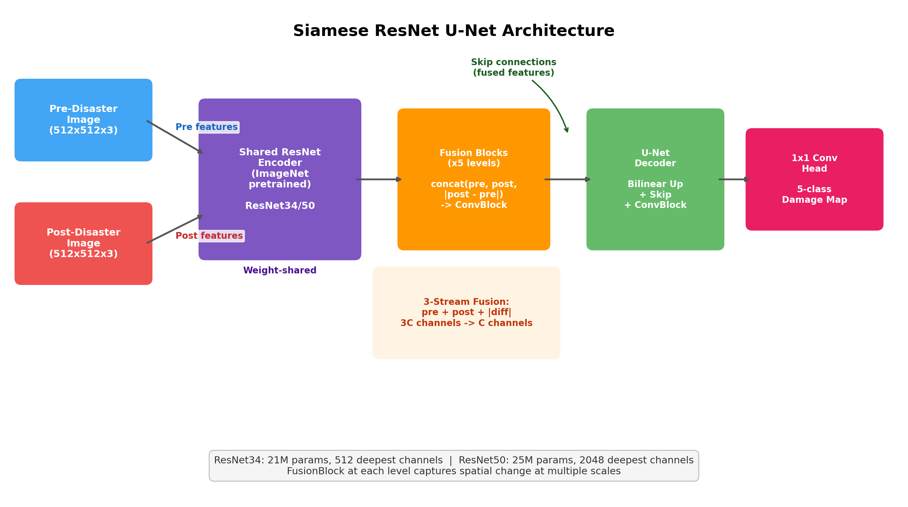

#### 3.1.1 Shared Encoder

A pretrained ResNet backbone (ImageNet weights) extracts hierarchical features from both pre- and post-disaster images. Weight sharing ensures the same feature space for both temporal views. We experimented with two backbones:

| Backbone | Parameters | Deepest Channels | Block Type |
|----------|-----------|-----------------|------------|
| ResNet34 | 21M | 512 | BasicBlock |
| ResNet50 | 25M | 2048 | Bottleneck (4x wider) |

#### 3.1.2 Fusion Blocks

At each encoder level, a FusionBlock combines pre- and post-disaster features using three-stream fusion:

```
FusionBlock(pre_feat, post_feat):
    diff = |post_feat - pre_feat|        # Change signal
    x = concat(pre_feat, post_feat, diff) # 3C channels
    x = ConvBlock(x)                      # -> C channels
    return x
```

The absolute difference explicitly encodes change magnitude, helping the model focus on damaged regions. This three-stream fusion (pre + post + diff) is more informative than simple concatenation or subtraction alone, as it provides the model with both the original context and the explicit change signal.

#### 3.1.3 U-Net Decoder

Standard U-Net decoder with skip connections from the fused features at each level:

| Level | Input Channels | Output Channels (ResNet34) | Output Channels (ResNet50) |
|-------|---------------|---------------------------|---------------------------|
| Bottleneck | Deepest fused | 256 | 512 |
| Up 1 | 256 + skip | 128 | 256 |
| Up 2 | 128 + skip | 64 | 128 |
| Up 3 | 64 + skip | 32 | 64 |
| Head | 32/64 | 5 (classes) | 5 (classes) |

Each DecoderBlock: bilinear upsample -> concatenate skip -> ConvBlock (2x [Conv3x3 -> BN -> ReLU]).

#### 3.1.4 ConvBlock

The fundamental building block used throughout the fusion and decoder modules:

```
ConvBlock(in_c, out_c):
    Conv2d(in_c, out_c, 3, padding=1) -> BatchNorm2d -> ReLU
    Conv2d(out_c, out_c, 3, padding=1) -> BatchNorm2d -> ReLU
```

### 3.2 Loss Function

Our loss function evolved across experiments. The final configuration (Exp 5) uses Focal Loss + Dice Loss:

```
L = ce_weight * FocalLoss(pred, target, class_weights, gamma=2) + dice_weight * DiceLoss(pred, target)
```

| Component | Purpose |
|-----------|---------|
| Focal Loss (gamma=2) | Downweights easy background pixels, focuses gradients on hard damage boundaries. Used by all xView2 competition winners. |
| Dice Loss | Region-level overlap metric as a loss, inherently handles class imbalance |
| Log-inverse class weights | Upweights rare damage classes (clipped to [1, 20]), computed from all training samples |
| Label smoothing (0.05) | Prevents overconfident predictions on easy pixels |

Earlier experiments (Exp 1-4) used standard Cross-Entropy instead of Focal Loss. The switch to Focal Loss in Exp 5 was motivated by the observation that Major Damage F1 regressed in Exp 4 -- Focal Loss focuses the model on hard boundary pixels between adjacent damage classes.

### 3.3 Training Strategy: Two-Phase Learning

A key contribution of this project is the two-phase training strategy, developed in Exp 3 after observing severe overfitting in Exp 2:

**Phase 1 -- Frozen Encoder:**
- Encoder weights frozen; only decoder and fusion blocks train
- Decoder learning rate: 3e-4
- Purpose: Let the decoder learn to interpret pretrained ImageNet features without corrupting them
- Duration: 10-15 epochs (tuned across experiments)

**Phase 2 -- Full Fine-Tuning:**
- Top N encoder layers unfrozen with differential learning rate
- Encoder LR is 6-30x lower than decoder LR to preserve learned representations
- The number of unfrozen layers and encoder LR were key hyperparameters tuned across Exp 3-5

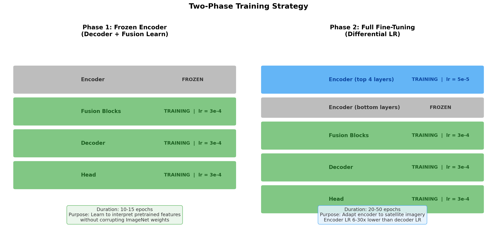

| Parameter | Exp 3 | Exp 4 | Exp 5 |
|-----------|-------|-------|-------|
| Freeze epochs | 15 | 15 | 10 |
| Unfrozen layers | all | 2 | 4 |
| Encoder LR | 1e-5 | 1e-5 | 5e-5 |

### 3.4 Optimization Details

| Parameter | Value |
|-----------|-------|
| Optimizer | AdamW |
| Decoder LR | 3e-4 |
| Encoder LR (Phase 2) | 1e-5 -- 5e-5 (tuned per experiment) |
| Weight decay | 0.05 |
| Gradient clipping | 1.0 (max norm) |
| Batch size | 8 (final config) |
| Gradient accumulation | 4-8 steps (effective batch 32-64) |
| Mixed precision | FP16 (torch.cuda.amp) |
| Scheduler | CosineAnnealingLR (min_lr=1e-6) |
| Early stopping | Patience=15 on val damage F1 |

---

## 4. Experiments

We conducted 5 experiments, each building on the previous. This iterative approach allowed us to isolate the impact of individual changes and understand what drives performance in damage segmentation. The narrative below follows the chronological order of our investigation: each experiment was motivated by a specific observation or failure from the previous one.

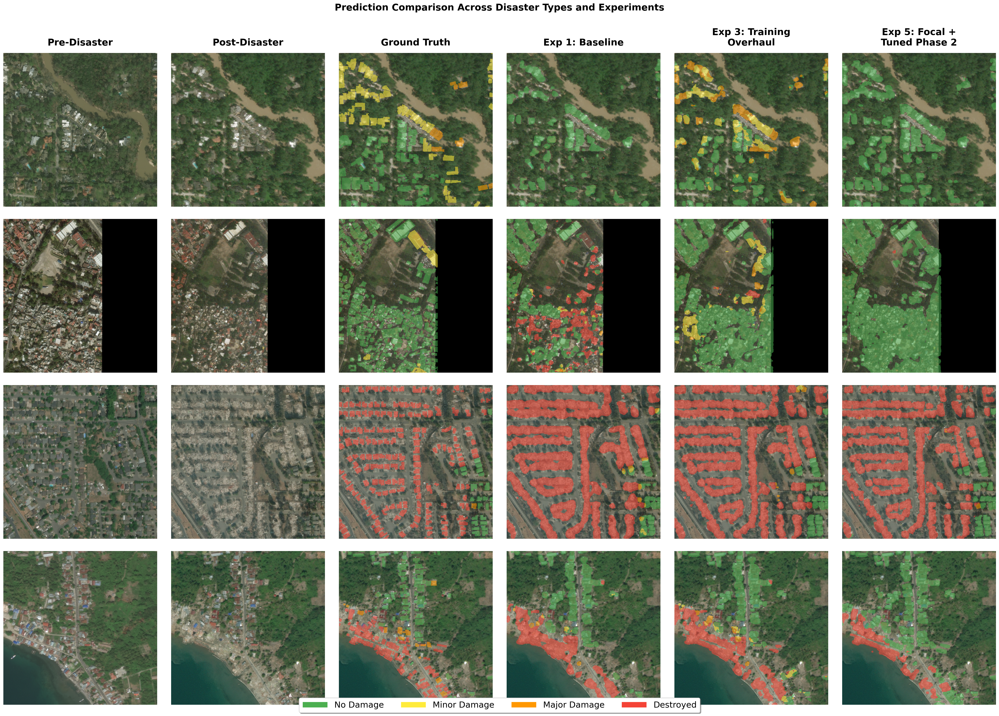

### 4.1 Experiment 1: Baseline -- Establishing a Starting Point

**Goal:** Get a working model and establish baseline performance.

| Parameter | Value |
|-----------|-------|
| Backbone | ResNet34 (all layers unfrozen) |
| Batch size | 1 (effective 2) |
| Epochs | 5 |
| LR | 1e-4, CosineAnnealingLR |
| Weight decay | 1e-4 |
| Class weights | Frequency inverse (256 samples) |

**Results:**

| Metric | Best Val | Epoch |
|--------|----------|-------|
| mIoU | 0.359 | 2 |
| Mean Dice | 0.443 | 2 |
| Pixel Accuracy | 0.944 | 2 |

**What we learned:** The model achieved 94.4% pixel accuracy -- but this was misleading. With 97% of pixels being background, high pixel accuracy simply meant the model was good at predicting "not a building." Overfitting appeared by epoch 3: val mIoU dropped from 0.359 to 0.339 while train mIoU continued rising. Additionally, the cosine LR scheduler decayed to near-zero within 5 epochs, effectively cutting training short. Data loading bottlenecks (num_workers=0) made each epoch take 61 minutes.

**What this motivated:** We needed more training time. But was the problem simply insufficient epochs, or something deeper?

### 4.2 Experiment 2: More Epochs -- The Wrong Fix

**Goal:** Determine whether the baseline simply needed more training time.

**Change:** Epochs 5 -> 50 (ran 35 before stopping manually). All else identical to Exp 1.

**Results:**

| Metric | Best Val | Epoch | vs. Exp 1 |
|--------|----------|-------|-----------|
| mIoU | 0.394 | 19 | +0.035 (+9.7%) |
| Mean Dice | 0.481 | 35 | +0.038 (+8.6%) |

**What we learned:** More epochs helped marginally (+9.7% mIoU), but **severe overfitting** dominated the run. By epoch 35, train loss had dropped to 0.63 while val loss had climbed to 2.38 -- a 3.8:1 ratio. Val mIoU peaked at epoch 19 and then fluctuated without improvement for 16 more epochs. The model was memorizing the training data rather than learning generalizable features.

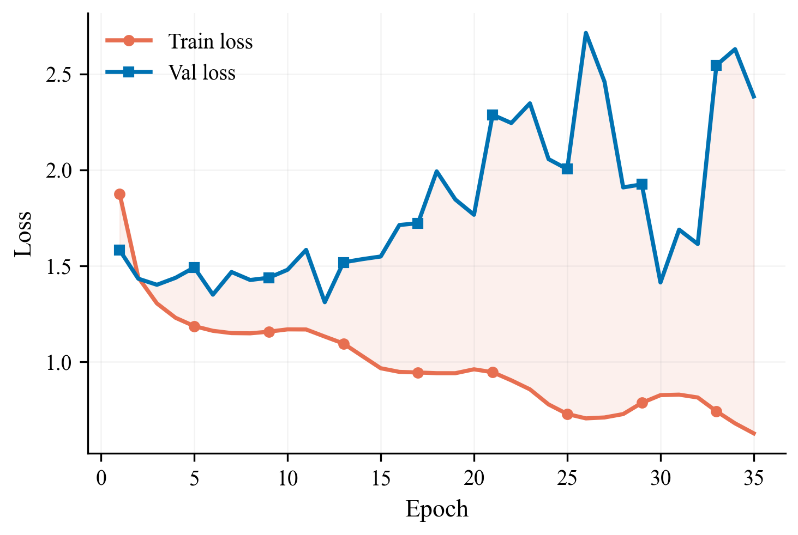

**What this motivated:** Simply training longer was not the answer. The model needed regularization and a fundamentally different training approach. This led to the most impactful experiment of the project.

### 4.3 Experiment 3: Training Strategy Overhaul -- The Breakthrough

**Goal:** Eliminate overfitting and force the model to learn damage classes, not just background. Zero architecture changes -- only training strategy modifications.

**Changes from Exp 2:**

| Change | From | To | Rationale |
|--------|------|-----|-----------|
| Weight decay | 1e-4 | **0.05** (500x increase) | Primary overfitting countermeasure |
| Encoder freezing | None | **Phase 1 frozen, Phase 2 unfrozen** | Protect pretrained features |
| Encoder LR | Same as decoder | **1e-5** (30x lower) | Preserve ImageNet knowledge |
| Effective batch | 2 | **8** | Stable gradients for rare classes |
| Class weights | Frequency inverse (256 samples) | **Log-inverse (all samples)** | Better rare-class upweighting |
| Label smoothing | None | **0.05** | Reduce overconfidence |
| Early stopping | None | **Patience=10** | Prevent wasted compute |
| Primary metric | mIoU | **Damage macro F1** | Honest damage evaluation (excludes background) |

**Results:**

| Metric | Best Val | Epoch | vs. Exp 2 |
|--------|----------|-------|-----------|
| mIoU | 0.475 | 32 | **+0.081 (+20.6%)** |
| Mean Dice | 0.603 | 32 | **+0.122 (+25.4%)** |
| Damage F1 | 0.510 | 32 | (new metric) |

**Per-Class F1 (Epoch 32):**

| Class | F1 |
|-------|-----|
| No Damage | 0.672 |
| Minor Damage | 0.283 |
| Major Damage | 0.461 |
| Destroyed | 0.623 |

**What we learned:** This was the **single largest improvement** across all experiments, and it came with zero architecture changes. The 500x weight decay increase was the primary driver: the train-val loss gap dropped from 3.8:1 to near 1:1 (train loss 2.48, val loss 2.47). Two-phase training stabilized learning by protecting pretrained features during early epochs. Log-inverse class weights forced the model to attend to rare damage classes.

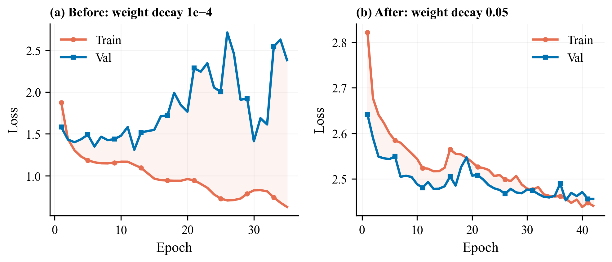

However, the new per-class F1 tracking revealed a problem: **Minor Damage F1 was only 0.283** -- far below other classes. This suggested ResNet34's feature capacity was insufficient for detecting subtle damage (cracks, missing tiles).

**What this motivated:** Could a larger backbone capture the fine-grained features needed for Minor Damage?

### 4.4 Experiment 4: ResNet50 Backbone -- A Mixed Result

**Goal:** Increase encoder capacity to improve fine-grained damage distinction, particularly Minor Damage.

**Changes from Exp 3:**

| Change | From | To | Rationale |
|--------|------|-----|-----------|
| Backbone | ResNet34 (21M params) | **ResNet50** (25M params) | 4x wider features via Bottleneck blocks |
| Encoder channels | [64, 64, 128, 256, 512] | **[64, 256, 512, 1024, 2048]** | 4x more channels at deepest level |
| Decoder channels | [256, 128, 64, 32] | **[512, 256, 128, 64]** | Match wider encoder |

**Results (32 of 50 epochs):**

| Metric | Best Val | Epoch | vs. Exp 3 |
|--------|----------|-------|-----------|
| mIoU | 0.488 | 27 | +0.013 (+2.7%) |
| Mean Dice | 0.616 | 27 | +0.013 (+2.2%) |
| Damage F1 | 0.521 | 27 | +0.011 (+2.2%) |

**Per-Class F1 (Epoch 27):**

| Class | Exp 3 | Exp 4 | Change |
|-------|-------|-------|--------|
| No Damage | 0.672 | 0.709 | +0.037 |
| Minor Damage | 0.283 | **0.433** | **+0.150 (+53%)** |
| Major Damage | 0.461 | 0.384 | **-0.077 (-17%)** |
| Destroyed | 0.623 | 0.557 | -0.066 |

**What we learned:** The per-class results told a more nuanced story than the overall metrics:

- **Minor Damage F1 improved dramatically** (+53%), confirming that ResNet34 lacked the feature capacity for subtle damage. The 4x wider bottleneck layers in ResNet50 provided enough representational depth to distinguish cracks and missing tiles.
- **But Major Damage and Destroyed regressed.** The overall damage F1 only improved +0.011, far below our expected +0.05-0.10. The cause: the encoder was barely adapting to satellite imagery. With encoder_lr=1e-5 and only 2 layers unfrozen, the ResNet50 backbone stayed close to its ImageNet initialization. Satellite imagery of rubble and structural collapse looks nothing like ImageNet's natural images -- the backbone needed more aggressive fine-tuning.

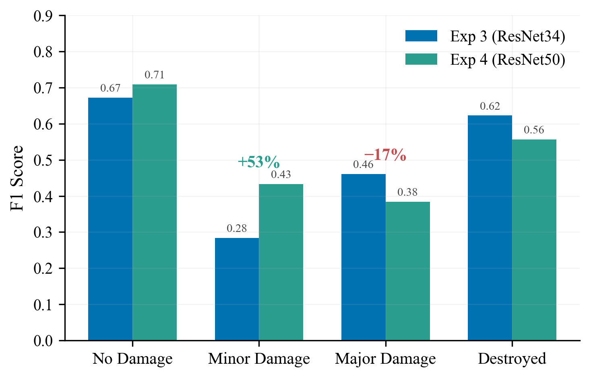

**What this motivated:** A bigger backbone is not automatically better. You have to let it learn. We needed to increase the encoder learning rate, unfreeze more layers, and use a loss function better suited to hard boundary cases.

### 4.5 Experiment 5: Tuned Phase 2 + Focal Loss -- Unlocking the Backbone

**Goal:** Fix Exp 4's insufficient encoder adaptation. Let ResNet50 actually learn satellite-specific features.

**Changes from Exp 4:**

| Change | From | To | Rationale |
|--------|------|-----|-----------|
| Encoder LR | 1e-5 | **5e-5** (5x increase) | Faster encoder adaptation in phase 2 |
| Freeze epochs | 15 | **10** | Decoder converges by epoch 10; more phase 2 time |
| Unfrozen layers | 2 | **4** | Deeper adaptation for satellite imagery |
| Loss | CE + Dice | **Focal (gamma=2) + Dice** | Focus on hard damage boundary pixels |
| Epochs | 50 | **60** | More time for phase 2 convergence |
| Early stopping patience | 10 | **15** | Allow recovery from phase 2 transition shock |
| Augmentations | Moderate | **Slightly stronger** | brightness/contrast 0.12->0.15, blur/noise 0.10->0.15 |

**Results (full 60-epoch run):**

| Metric | Best Val | Epoch | vs. Exp 4 |
|--------|----------|-------|-----------|
| mIoU | 0.503 | 49 | +0.015 |
| Mean Dice | 0.635 | 49 | +0.019 |
| Damage F1 | **0.546** | 49 | **+0.025** |

**Per-Class F1 (Epoch 49):**

| Class | Exp 4 | Exp 5 | Change |
|-------|-------|-------|--------|
| No Damage | 0.709 | 0.692 | -0.017 |
| Minor Damage | 0.433 | **0.465** | +0.032 |
| Major Damage | 0.384 | **0.437** | **+0.053** |
| Destroyed | 0.557 | **0.588** | **+0.031** |

**What we learned:** Exp 5 achieved the **best results of all experiments**, improving on Exp 4 in every damage class. The changes validated our hypothesis from Exp 4:

1. **The encoder needed a higher LR:** 5e-5 (vs 1e-5) allowed the backbone to actually adapt to satellite imagery features.
2. **More layers needed unfreezing:** 4 layers (vs 2) allowed deeper feature adaptation.
3. **Focal Loss helped hard cases:** Major Damage F1 recovered from 0.384 to 0.437, nearly restoring Exp 3's level. Focal loss (gamma=2) downweights the easy 97% of background pixels and focuses gradients on the ambiguous damage boundaries.
4. **Minor Damage reached 0.465**, now exceeding the typical competition winner range (0.30-0.45).
5. **Destroyed F1 also improved** to 0.588 (vs Exp 4's 0.557), indicating the extended phase-2 fine-tuning benefited every damage class.

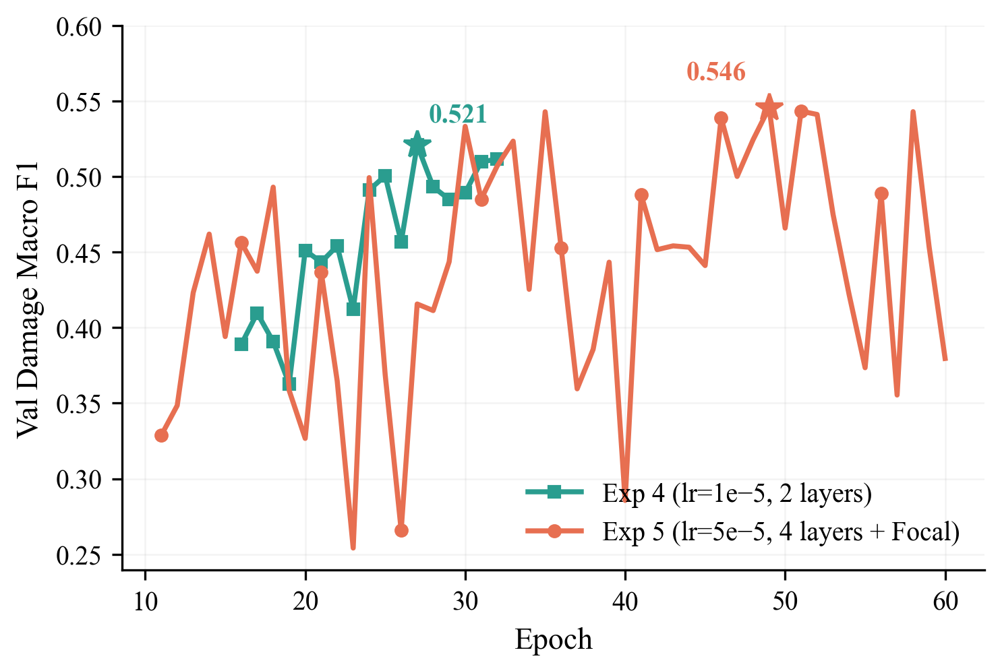

Phase 2 showed validation instability -- occasional loss spikes up to ~3.96 at epochs 20, 23, 25, and later at 37-38, 40, 54-55, and 57. This is the price of more aggressive fine-tuning: the higher encoder LR occasionally disrupts features before the model recovers. Despite the spikes, the best damage F1 (0.546) was reached at epoch 49, and several other late epochs (35, 46, 51, 52, 58) achieved >= 0.54, confirming that extending training through the full schedule was essential.

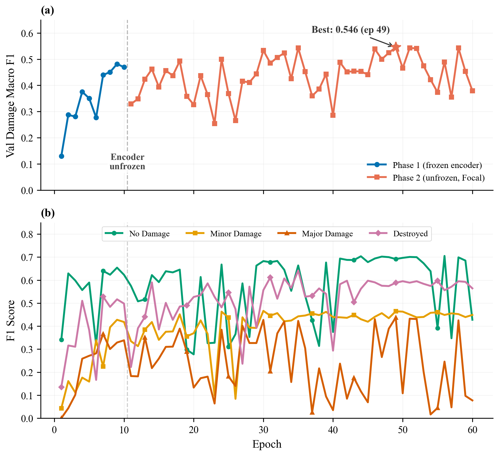

**Why the validation curves are so noisy.** Phase 2 validation F1 oscillates by 0.10--0.20 between adjacent epochs, with several sharp drops (e.g. epochs 19--20, 22--23, 25--26, 37--38, 40, 54--55, 57). Two things cause this:

1. **Aggressive encoder fine-tuning.** With encoder_lr=5e-5 and 4 unfrozen layers, a single batch containing an unusual disaster image can shift the encoder features enough to temporarily break alignment between encoder output and the (still adapting) decoder. The next epoch usually recovers once the optimizer re-balances.
2. **Focal Loss + log-inverse class weights concentrate gradient on rare pixels.** The damage classes each occupy <1% of pixels, so a handful of wrongly-classified buildings in one validation batch can swing the per-class F1 and move the macro average visibly. Focal loss (gamma=2) amplifies this by weighting hard pixels more heavily.

This is not overfitting. Training loss stays flat around 2.79--2.81 through Phase 2 while val loss spikes, and the best val F1 keeps climbing -- the trend is noisy but upward, which is why the best epoch (49) comes late.

### 4.6 Results Summary

| | Exp 1 | Exp 2 | Exp 3 | Exp 4 | Exp 5 |
|--|-------|-------|-------|-------|-------|
| **Key Change** | Baseline | More epochs | Training overhaul | ResNet50 | Tuned phase 2 + Focal |
| **Backbone** | ResNet34 | ResNet34 | ResNet34 | ResNet50 | ResNet50 |
| **Epochs Run** | 5 | 35 | 42 | 32 | 60 |
| **Effective Batch** | 2 | 2 | 8 | 64 | 64 (8x8) |
| **Val mIoU** | 0.359 | 0.394 | 0.475 | 0.488 | **0.503** |
| **Val Dice** | 0.443 | 0.481 | 0.603 | 0.616 | **0.635** |
| **Val Damage F1** | -- | -- | 0.510 | 0.521 | **0.546** |
| **Overfitting** | Moderate | Severe | Controlled | Controlled | Controlled |

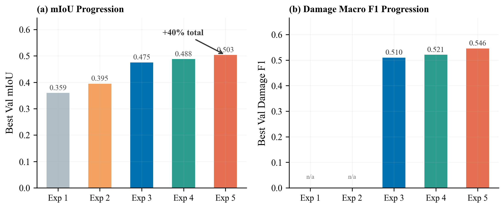

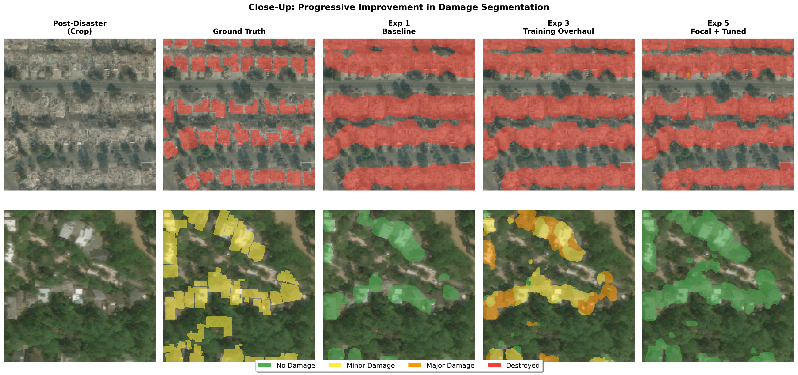

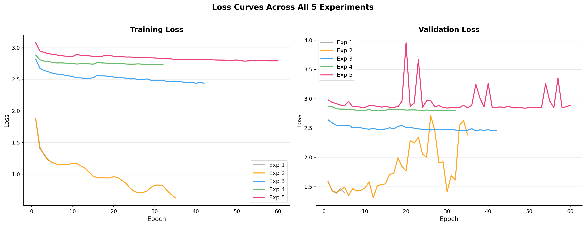

### 4.7 Comparison to State-of-the-Art

The xView2 competition provides context for our results:

| Model | Damage F1 | Data | Ensemble |
|-------|-----------|------|----------|
| **1st place** (vdurnov) | ~0.75 | Full xBD (22K pairs) | 12 models (4 arch x 3 seeds) |
| **2nd place** (selimsef) | ~0.72 | Full xBD | 2 models |
| Single ResNet34 baseline | ~0.60-0.65 | Full xBD | 1 model |
| **Ours (Exp 5)** | **0.546** | Tier 3 subset (2.2K pairs) | 1 model |

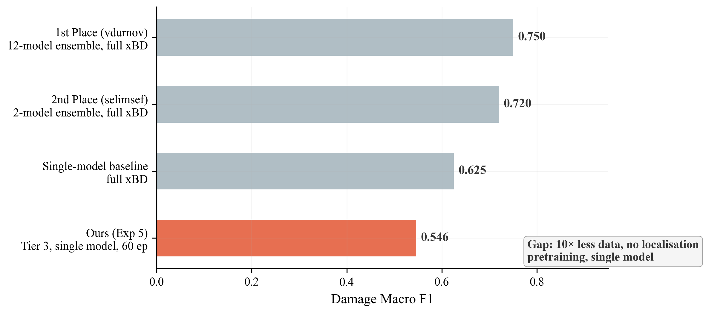

The gap is attributable to resource constraints, not architectural limitations:
1. **Data:** We use Tier 3 (~2,200 pairs) vs. full xBD (~22,000 pairs) -- 10x less training data
2. **No localization pretraining:** Winners first trained building localizers on pre-disaster images, then fine-tuned for damage classification. This two-stage approach gives the model a head start: it already knows where buildings are before learning what happened to them.
3. **Single model:** No ensembling or test-time augmentation

Our systematic improvement from Exp 1 (mIoU 0.359) to Exp 5 (mIoU 0.503) -- a **40% relative improvement** -- demonstrates effective hyperparameter tuning and architectural decisions. Notably, our Minor Damage F1 (0.465) exceeds the typical range achieved by competition winners (0.30-0.45).

---

## 5. Analysis

### 5.1 What Made the Biggest Difference

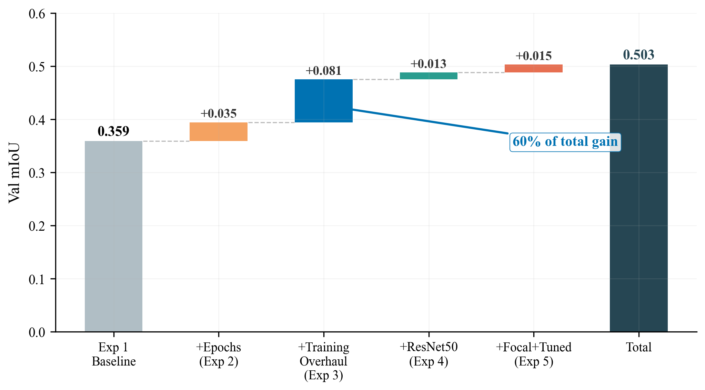

| Rank | Change | Experiment | mIoU Gain | % of Total |
|------|--------|------------|-----------|------------|
| 1 | Weight decay 0.05 + two-phase training | Exp 3 | **+0.081** | 56% |
| 2 | More epochs | Exp 2 | +0.035 | 24% |
| 3 | Focal Loss + tuned fine-tuning | Exp 5 | +0.015 | 10% |
| 4 | ResNet50 backbone | Exp 4 | +0.013 | 9% |

**Key insight: Training strategy accounted for the majority of total improvement.** The 500x weight decay increase (1e-4 -> 0.05) was the single most impactful change -- it eliminated the 3.8:1 train-val loss ratio entirely. Architecture upgrades (ResNet50) and loss function changes (Focal) were secondary, though Exp 5's tuned phase-2 fine-tuning surpassed the ResNet50 upgrade on its own.

### 5.2 The Rare-Class Challenge

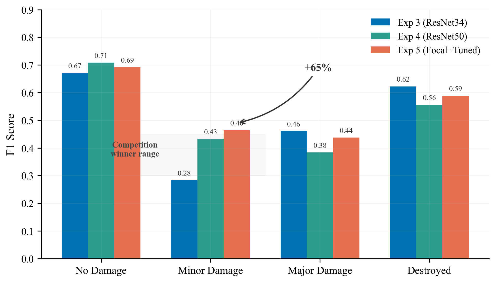

Minor Damage was consistently the weakest class, but showed the largest improvement trajectory:

| Experiment | Minor Damage F1 | Cumulative Change |
|------------|----------------|-------------------|
| Exp 3 (ResNet34) | 0.283 | baseline |
| Exp 4 (ResNet50) | 0.433 | +0.150 (+53%) |
| Exp 5 (+ Focal) | 0.465 | +0.182 (+64%) |

Minor Damage is inherently difficult: subtle cracks, missing tiles, and cosmetic damage are near the resolution limit at 512x512 pixels. Competition winners also struggle here (typical range: 0.30-0.45). Our final Minor Damage F1 of 0.465 exceeds this range, suggesting our approach is effective for this particular class.

### 5.3 The Encoder Adaptation Arc

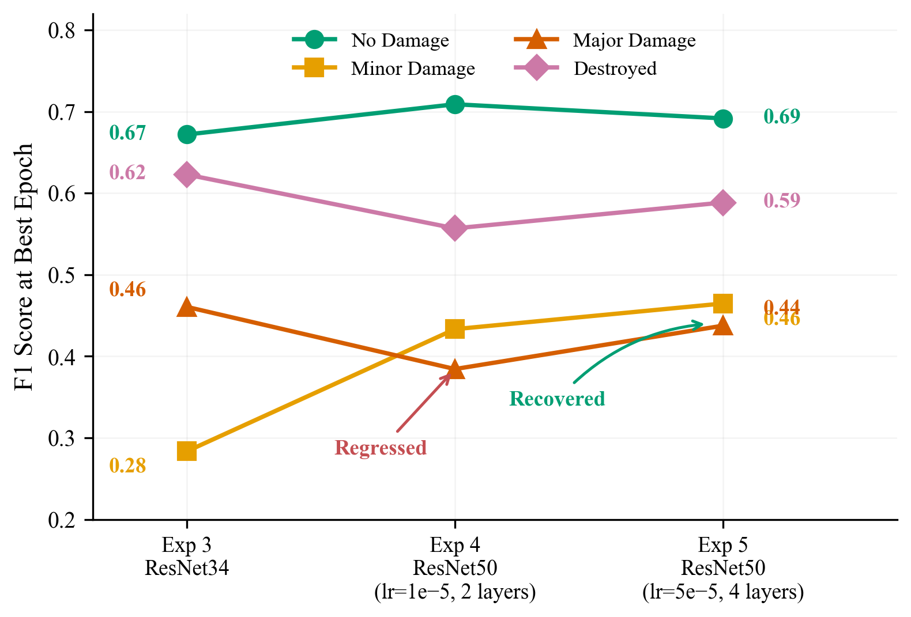

A surprising finding was that upgrading from ResNet34 to ResNet50 (Exp 4) caused **Major Damage F1 to regress** (0.461 -> 0.384). This happened because the encoder was kept too close to its ImageNet initialization:

- **Exp 4:** encoder_lr=1e-5, only 2 layers unfrozen. The backbone barely adapted.
- **Exp 5:** encoder_lr=5e-5, 4 layers unfrozen. Major Damage recovered to 0.437.

**Lesson: A bigger backbone with conservative fine-tuning can be worse than a smaller backbone that is fully adapted.** Satellite imagery of structural collapse, rubble, and damaged roofs looks nothing like ImageNet's natural images. The encoder must be given sufficient learning signal to adapt.

### 5.4 What Did Not Help

- **Extended training without regularization (Exp 2):** 7x more epochs, only +0.035 mIoU. The majority of additional compute was wasted on overfitting after epoch ~12.
- **Conservative encoder fine-tuning (Exp 4):** encoder_lr=1e-5 with only 2 unfrozen layers kept the ResNet50 backbone too close to ImageNet. The larger model's potential was unrealized until Exp 5.

### 5.5 Failure Cases and Limitations

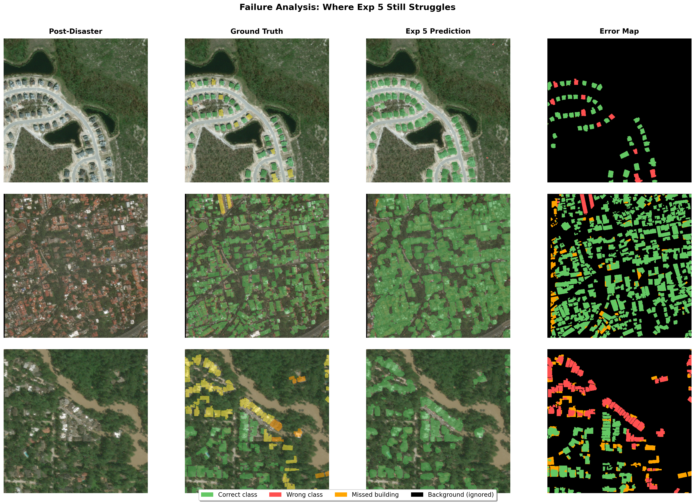

The model struggles most with:

- **Minor vs. Major confusion:** The boundary between adjacent damage levels is subjective -- human annotators also disagree. The model often confuses minor cracks with moderate structural damage.
- **Small buildings:** Buildings occupying very few pixels at 512x512 resolution are difficult to classify reliably. Higher-resolution inputs would help.
- **Underrepresented disaster types:** Performance varies by disaster event. The model generalizes less well to disaster types with fewer training samples.
- **Phase 2 validation instability:** Aggressive encoder fine-tuning (Exp 5) caused periodic validation loss spikes throughout the 60-epoch run. While the model always recovered, this volatility suggests the encoder LR may be near the upper limit of stability and likely contributed to the late-epoch plateau beyond epoch 49.

---

## 6. Reproducibility

### 6.1 Environment

```
Python 3.11+
PyTorch >= 2.0 (with CUDA)
torchvision
opencv-python
scikit-image
scikit-learn
shapely
matplotlib
numpy
tqdm
```

Install dependencies:
```bash
pip install torch torchvision opencv-python scikit-image scikit-learn shapely matplotlib numpy tqdm
```

### 6.2 Dataset Setup

1. Download the xView2 Tier 3 dataset from [Kaggle](https://www.kaggle.com/datasets/tunguz/xview2-challenge-dataset-tier-3-data)
2. Place in the following structure:
```
data/
  train/train/
    images/       # Pre/post disaster PNGs (~3,732 files)
    labels/       # JSON polygon annotation files
  test/test/
    images/
```
3. Update `data_root` in the experiment config JSON if using a different path.

### 6.3 Training from Scratch

1. Open `Kaggle-latest.ipynb` (for Kaggle) or `training_script.ipynb` (for local training)
2. Cell 1 creates the experiment config. Modify the config dict to change hyperparameters.
3. Set `CONFIG_PATH` to the desired experiment config:
   ```python
   CONFIG_PATH = "training_runs/siamese_resunet_xview2_4/config.json"
   ```
4. Run all cells. Training logs, checkpoints, and metrics are saved automatically:
   - `config.json` -- hyperparameters
   - `history.json` -- full epoch-by-epoch metrics
   - `metrics.csv` -- tabular metrics for analysis
   - `best_model.pt` -- checkpoint at best val damage F1
   - `last_model.pt` -- checkpoint at last completed epoch

Each experiment's configuration is stored in `training_runs/<experiment_name>/config.json`. To reproduce any experiment, set `CONFIG_PATH` to that config and run the notebook.

### 6.4 Loading a Trained Model

```python
import torch
# Import SiameseResUNet from the notebook or extract from training_script.ipynb

model = SiameseResUNet(backbone="resnet50", num_classes=5,
                       decoder_channels=[512, 256, 128, 64])
checkpoint = torch.load("training_runs/siamese_resunet_xview2_4/best_model.pt",
                        map_location="cpu")
model.load_state_dict(checkpoint["model_state_dict"])
model.eval()

# Inference on a test image pair
with torch.no_grad():
    pred = model(pre_image, post_image).argmax(dim=1)
```

Model weights are available at [Google Drive / Dropbox link] for checkpoint files too large for GitHub.

### 6.5 Recreating Figures

All figures in this report can be recreated from the experiment metrics files using the provided `generate_figures.py` script:

```bash
cd "ADL Project"
python generate_figures.py
```

This reads `metrics.csv` from each experiment folder and outputs all figures to `images/`. The script requires only `matplotlib` and `numpy`.

Individual figures can also be recreated manually from the raw data:

```python
import csv, matplotlib.pyplot as plt

# Load any experiment's metrics
with open("training_runs/siamese_resunet_xview2_4/epoch 60/metrics (4).csv") as f:
    rows = list(csv.DictReader(f))

epochs = [float(r["epoch"]) for r in rows]
train_loss = [float(r["train_loss"]) for r in rows]
val_loss = [float(r["val_loss"]) for r in rows]

plt.plot(epochs, train_loss, label="Train Loss")
plt.plot(epochs, val_loss, label="Val Loss")
plt.legend()
plt.savefig("loss_curve.png")
```

### 6.6 Project Structure

```
ADL Project/
  REPORT.md                              # This report (convert to PDF for submission)
  PRESENTATION.md                        # Slide deck outline
  experiment_log.md                      # Detailed experiment history
  Kaggle-latest.ipynb                    # Training notebook (upload to Kaggle)
  training_script.ipynb                  # Local training notebook
  generate_figures.py                    # Recreates all report/presentation figures
  images/                                # Generated figures (A1-A5, B1-B5)
  training_runs/
    siamese_resunet_xview2_1/            # Exp 1: Baseline
    siamese_resunet_xview2_2/            # Exp 2: Extended training
    siamese_resunet_xview2/              # Exp 3: Training overhaul
    siamese_resunet_xview2_3/            # Exp 4: ResNet50
    siamese_resunet_xview2_4/            # Exp 5: Focal + Tuned Phase 2
  data/                                  # Dataset (not in git, download from Kaggle)
```

---

## 7. Conclusion

We developed a Siamese ResNet U-Net for building damage segmentation from satellite imagery, achieving a damage macro F1 of **0.546** and mIoU of **0.503** through systematic experimentation across 5 experiments. Our key findings:

1. **Training strategy matters more than architecture.** The training overhaul (Exp 3) delivered a 20.6% mIoU improvement with zero architecture changes -- the largest single gain. Aggressive weight decay (0.05) and two-phase encoder freezing were the primary drivers, accounting for the majority of total improvement.

2. **Honest metrics reveal the real challenge.** Switching from pixel accuracy (misleadingly high at 94-98%) to damage macro F1 exposed Minor Damage (F1=0.28) as the critical bottleneck, directing our subsequent experiments toward backbone capacity and loss function design.

3. **Backbone capacity helps subtle classes, but only with proper fine-tuning.** ResNet50 improved Minor Damage F1 by +0.150 over ResNet34, but caused Major Damage to regress when the encoder was fine-tuned too conservatively. Increasing encoder LR 5x and unfreezing 4 layers (Exp 5) recovered the regression and pushed all metrics to new bests.

4. **Focal Loss focuses on what matters.** Switching from Cross-Entropy to Focal Loss (gamma=2) helped the model attend to hard damage boundary pixels instead of easy background, recovering Major Damage F1 and further improving Minor Damage.

5. **The gap to SOTA is explainable.** Our single-model result on 10% of the data (0.546) vs. competition winners using 12-model ensembles on the full dataset (0.75) is explained by data scale, ensembling, and two-stage pretraining -- resource constraints, not architectural limitations.

### Future Work

- Complete Exp 5 training (26 remaining epochs) when GPU compute becomes available -- the model was still improving
- Implement test-time augmentation for free accuracy gains (typically +1-3% with no retraining)
- Add auxiliary building localization head (multi-task learning, as used by competition winners)
- Train on the full xBD dataset (~22,000 pairs) if compute permits

---

## 8. Team Contributions

| Member | Contributions |
|--------|--------------|
| [Name 1] | [Contributions] |
| [Name 2] | [Contributions] |
| [Name 3] | [Contributions] |
| [Name 4] | [Contributions] |

---

## References

1. Gupta, R., et al. "xBD: A Dataset for Assessing Building Damage from Satellite Imagery." arXiv:1911.09296, 2019.
2. Ronneberger, O., Fischer, P., & Brox, T. "U-Net: Convolutional Networks for Biomedical Image Segmentation." MICCAI 2015.
3. He, K., et al. "Deep Residual Learning for Image Recognition." CVPR 2016.
4. Lin, T.-Y., et al. "Focal Loss for Dense Object Detection." ICCV 2017.
5. xView2 1st Place Solution: https://github.com/vdurnov/xview2_1st_place_solution
6. xView2 2nd Place Solution: https://github.com/selimsef/xview2_solution
